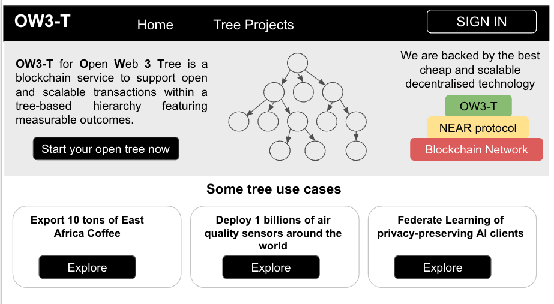
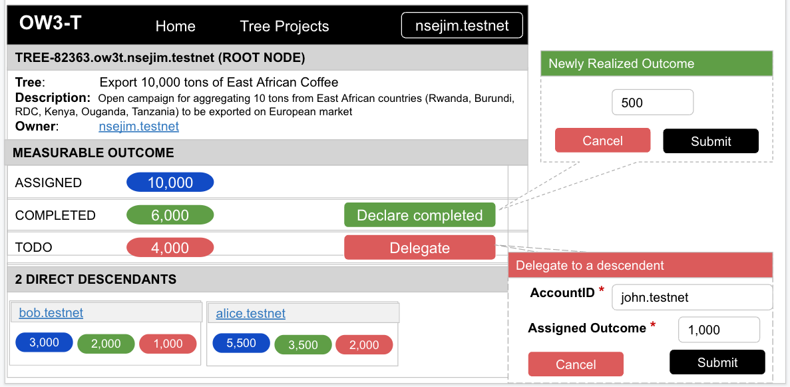
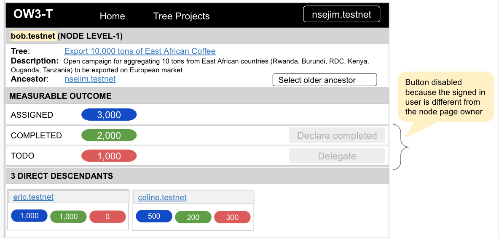

# OW3-T (Open Web 3 Tree)
## Introduction

OW3-T is a smart contrat that aims to support real-life contexts where stakeholders (humans, smart things, ..) aggregate a certain value in a trustless tree hierarchy. The current version of the smart contract considers "value" that can be represented by a numerical outcome. 

This smart contract is deployed on the NEAR TestNet with accountId or contractName "ow3t.nsejim.tesnet". 

Click [here](https://explorer.testnet.near.org/accounts/ow3t.nsejim.testnet) to explore OW3T transactions 
## Examples of real-life use cases
### 1. Large-scale service/product delivery 

Think about operational scenarios that require/involve a large scale of participants with delegation responsibility (outsourcing) organised in a tree hierarchy. The following are some examples that require large number of human resources to complete a service or deliver a product
- Periodically export 10,000 tons of coffee from East Africa to Europe
- Deploy and maintain billion of air quality sensors evenly deployed in all parts of the world.

### 2. Data aggregation in geo-distributed computer systems

There are more and more AI scenarios where centralizing collected data in the cloud in order to do AI analytics is not possible because data collectors are either either constrained by privacy-concerns or bandwidth connectivity. Therefore, data collectors carry out AI analytics locally and only share either the AI model updates (federated learning) or AI inference results. The AI results need to be bottom-up aggregated to create combined value. 

- [Secure verifiable aggregation for blockchain-based federated averaging](https://www.sciencedirect.com/science/article/pii/S2667295221000362)
## Installation

1. clone this repo
2. run `yarn` (or `npm install`)
3. run `yarn build` (or `npm run build`)

The contract source code is in `src/tree`
## Test Commands

**Compile assemblyscript source to WebAssembly**

```sh
yarn build                    # asb --target debug
yarn build:release            # asb
```

**Unit tests**

```sh
yarn test:unit                # asp --verbose --nologo -f unit.spec
```

**Integration tests**

TODO
## UI Wireframes

**Homepage**



<br/>

**Create tree**


<br/>

**Tree page**


<br/>

**Node page**



<br/>

## File Structure


## Future Works


### Smart contract clients

- Frontend Proof of Concept Development
### Scaling the smart contract

Update the smart contract to:
- Deploy a new contract for each tree. This will enable the tree's owner to be responsible of the storage staking of the tree data 
- Enable to have different type of contracts for different tree's nodes.

## Key Contributors

- [Jimmy NSENGA - @nsejim](https://github.com/nsejim)
