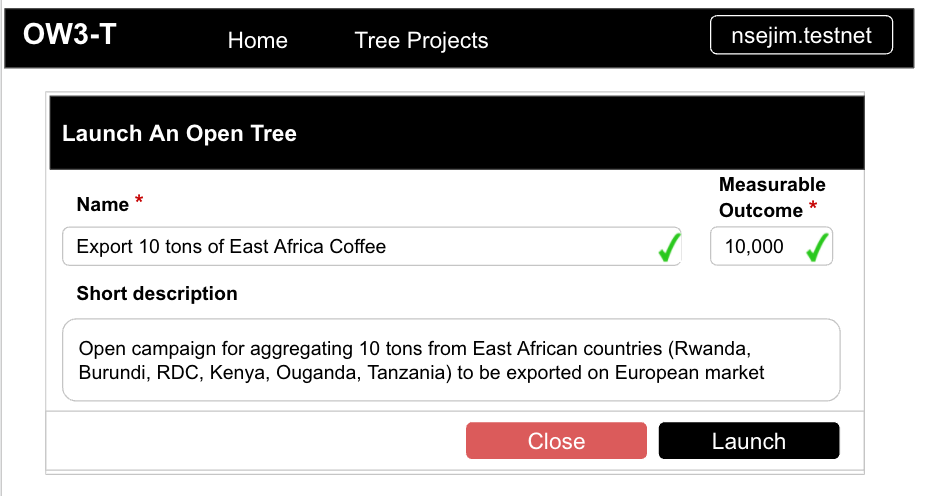

# OW3-T (Open Web 3 Tree)

A smart contrat to support real-life contexts organised in a tree hierarchy.

## Examples of real-life use cases

### Large-scale service/product delivery

Think about large-scale operational context that naturally requires to be organised into multi-level of delegation (outsourcing). To give some examples:
- Periodically export 10,000 tons of coffee from East Africa to Europe
- Deploy and maintain billion of air quality sensors evenly deployed in all parts of the world.
### Data aggregation in networked systems

Most of the (wireless) communication networks are organised in a networking topology based on a tree hiearchy. 

One particular case that is interesting to integrated Blockchain and AI is to federate the learning of isolated AI clients which are constrained to keep their data locally (for privacy reasons) while still collaborating to provide an aggregate business value. 

- [Privacy-Preserving Blockchain-Based Federated Learning for IoT Devices](https://www.researchgate.net/publication/343732662_Privacy-Preserving_Blockchain-Based_Federated_Learning_for_IoT_Devices) 

- [Integration of blockchain and federated learning for Internet of Things: Recent advances and future challenges](https://www.sciencedirect.com/science/article/pii/S0167404821001796)

## Installation

1. clone this repo
2. run `yarn install` (or `npm install`)
3. run `yarn build` (or `npm run build`)
4. run `yarn test` (or `npm run test`)
5. the contract source code is in `src/`

The code source documentation is available in [docs](./docs)

## Commands

near create-account "ow3t.nsejim.testnet" --masterAccount "nsejim.testnet"  --initialBalance 20
near deploy "ow3t.nsejim.testnet" build/debug/tree.wasm
near call "ow3t.nsejim.testnet" "createTree" '{"name": "HelloTree", "outcome": 10}' --accountId "nsejim.testnet"
near view ow3t.nsejim.testnet getTrees '{"accountId": "nsejim.testnet"}' 
near call ow3t.nsejim.testnet registerNode '{"treeId": "TREE-2048936065", "newNodeAccountId": "node1.nsejim.test", "description": "node1", "assignedOutcome": 5 }' --accountId "nsejim.testnet"
near view ow3t.nsejim.testnet getTodoOutcomeToDelegate '{"treeId": "TREE-2048936065", "accountId": "nsejim.testnet"}'
near call ow3t.nsejim.testnet updateCompletedOutcome '{"treeId": "TREE-2048936065", "outcome": 3 }' --accountId "nsejim.testnet"
**Compile source to WebAssembly**

```sh
yarn build                    # asb --target debug
yarn build:release            # asb
```

**Run unit tests**

```sh
yarn test:unit                # asp --verbose --nologo -f unit.spec
```

**Run simulation tests**

These tests can be run from within VSCode (or any Rust-compatible IDE) or from the command line.


```sh
yarn test:simulate            # yarn build:release && cargo test -- --nocapture
```

**Run all tests**

```sh
yarn test                     # yarn test:unit && test:simulate
```

**Run integration tests**

## UI Wireframes

**Homepage**


**Create tree**



**Tree page**


**Node page**


## File Structure (TODO)


## Live DApps on NEAR testnet (DONE)

This smart contract is deployed on TestNet with accountId "ow3t.nsejim.tesnet"

## Future Development

### From monolithic to microsmart-contracts

The current version of the smart contract manages the contract of
This means that the state storage

Every tree should have its own accountId
Every member should have its own


## Key Contributors

- [Jimmy NSENGA - @nsejim](https://github.com/nsejim)
